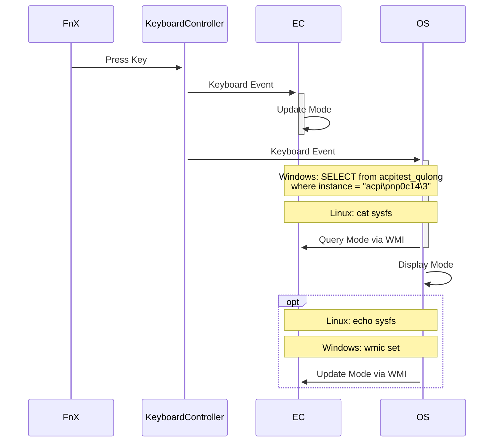

* Requirements

	1. kernel-devel (RHEL based) / linux-headers (Debian based)
	2. gcc & make

* Build & Install

	1. make
	2. insmod

* Usage

	1. Read: `cat /sys/devices/platform/PNP0C14:00/wmi_bus/wmi_bus-PNP0C14:00/ABBC0F6C-8EA1-11D1-00A0-C90629100000/performance_mode`
	2. Edit(only when AC pullged): `echo 1 | sudo tee /sys/devices/platform/PNP0C14:00/wmi_bus/wmi_bus-PNP0C14:00/ABBC0F6C-8EA1-11D1-00A0-C90629100000/performance_mode`

* Note

	Only tested with Code 01 V2.0

* TODO

	1.dkms or akmods
	2.use dmi (dmidecode? /sys/class/dmi/id/board_name )  to limit to code01 v2? dmi_system_id 

* How

	The seq i guess:

* Reference

	1. http://xf.iksaif.net/dev/wmidump.html
	2. https://wiki.ubuntu.com/Kernel/Reference/WMI
	3. [Writing a WMI driver - an introduction](https://lwn.net/Articles/391230/)
	4. https://github.com/microsoft/Windows-driver-samples/blob/main/wmi/wmiacpi/
	5. Linux source code: drivers/platform/x86
	6. http://smackerelofopinion.blogspot.com/2009/10/dumping-acpi-tables-using-acpidump-and.html
